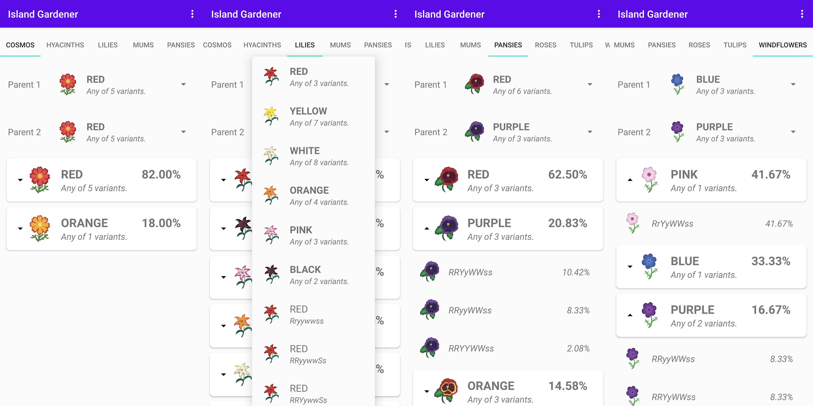

# Island Gardener
> Simplifying flower crossbreeding in AC:NH

Island Gardener simplifies flower breeding in Animal Crossing: New Horizons by providing you with all the information you need about crossbreeding.
It allows you to optimally choose which flowers to plant together in other to maximize the odds of getting that sweet rare hybrid you're missing.

## Installation

### Play Store (Recommended)
[Click here](https://play.google.com/store/apps/details?id=org.molguin.islandgardener) or search for "Island Gardener" on the Google Play Store, and enjoy.

### Manual

1. Download the latest APK from [releases](https://github.com/molguin92/IslandGardener/releases) and save it to the internal storage of your phone.
2. Using a file manager application, browse to the APK file location and install it.

## Release History

* 0.3.0beta Initial release.

## Meta

Reach me on Twitter: [@molguin92](https://twitter.com/molguin92).

Distributed under the GPLv3.0 license. See [LICENSE](LICENSE) for more information.

## Contributing

1. Fork it (<https://github.com/molguin92/IslandGardener/fork>)
2. Import the repo as an Android Studio Project.
3. Create your feature branch (`git checkout -b feature/fooBar`)
4. Commit your changes (`git commit -am 'Add some fooBar'`)
5. Push to the branch (`git push origin feature/fooBar`)
6. Create a new Pull Request
